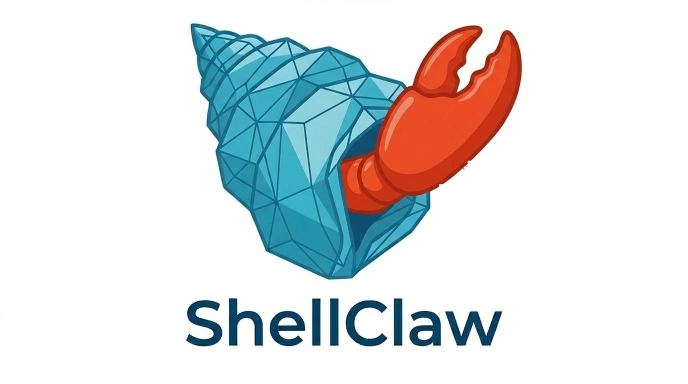

<p align="center">
  
</p>

<h1 align="center">ShellClaw</h1>

<p align="center">
  
  <a href="https://github.com/Naiqus/ShellClaw/actions"></a>
  <a href="https://pypi.org/project/shellclaw/"></a>
  <a href="https://pypi.org/project/shellclaw/"></a>
  <a href="https://github.com/Naiqus/ShellClaw/blob/main/LICENSE"></a>
  <a href="https://codecov.io/gh/Naiqus/ShellClaw"></a>
</p>

<p align="center">
  Built on <a href="https://github.com/NVIDIA/OpenShell"><strong>NVIDIA OpenShell</strong></a> — the safe, private runtime for autonomous AI agents.<br/>
  A hardware-agnostic OpenClaw agent orchestration CLI and drop-in replacement for NemoClaw<br/>
  that preserves OpenShell's sandboxing and policy controls without requiring NVIDIA GPU hardware.
</p>

> **Note:** This project is under active development and not yet production-ready. APIs and commands may change.

---

## Why OpenShell?

[OpenShell](https://github.com/NVIDIA/OpenShell) is NVIDIA's safe, private runtime for autonomous AI agents. It provides sandboxed execution environments that protect data, credentials, and infrastructure with declarative policies for filesystem access, network egress, and inference routing. ShellClaw builds on OpenShell as its sandboxing layer, adding a CLI-driven control plane for OpenClaw lifecycle management, migration, dynamic inference routing, and credential injection without making NVIDIA GPUs a deployment requirement.

## Installation

### Prerequisites

- Python 3.10+
- [Docker](https://docs.docker.com/get-docker/) (for sandbox containers)
- [OpenShell](https://github.com/NVIDIA/OpenShell) runtime installed

Install OpenShell first using NVIDIA's quickstart:

```shell
curl -LsSf https://raw.githubusercontent.com/NVIDIA/OpenShell/main/install.sh | sh
# or
uv tool install -U openshell
```

### Quick install

```shell
# Clone the repo
git clone https://github.com/Naiqus/ShellClaw.git
cd ShellClaw

# One-click setup (installs dependencies + configures environment)
./setup.sh
```

### Manual install

```shell
# Install with uv (recommended)
uv sync

# Or with pip
pip install -e .
```

After installation, run the onboarding wizard to configure your environment:

```shell
shellclaw onboard
```

## Features

* **Hardware-agnostic** -- runs on any Docker-capable machine (macOS, Linux, WSL2)
* **Dynamic inference routing** -- route to Ollama, OpenAI, Anthropic, Apple Metal, or any custom endpoint
* **State migration** -- seamlessly migrate existing `~/.openclaw` state into sandboxes
* **Secure by default** -- Landlock filesystem isolation + OPA network egress control
* **Credential injection** -- API keys never land on sandbox filesystem

## Quick Start

```shell
# Initialize and connect in seconds
shellclaw onboard
shellclaw connect
```

## Commands

| Command             | Description                                                    |
| ------------------- | -------------------------------------------------------------- |
| `shellclaw onboard` | Initialize: start gateway, configure inference, create sandbox |
| `shellclaw start`   | Start a sandbox (auto-starts gateway if needed)                |
| `shellclaw stop`    | Stop a sandbox (optionally stop gateway with `--gateway`)      |
| `shellclaw connect` | Attach terminal to a running sandbox                           |
| `shellclaw status`  | Show system-wide status                                        |
| `shellclaw migrate` | Migrate existing OpenClaw state into a sandbox                 |

## Inference Routing

Route the `inference.local` virtual endpoint to any backend:

```Shell
# Local Ollama
shellclaw onboard --inference-provider ollama --inference-model llama3

# Anthropic API
shellclaw onboard --inference-provider anthropic --inference-model claude-sonnet --inference-url https://api.anthropic.com

# OpenAI API
shellclaw onboard --inference-provider openai --inference-model gpt-4o --inference-url https://api.openai.com
```

## Architecture

```
+------------------+     +------------------+     +------------------+
|  ShellClaw CLI   | --> |  OpenShell       | --> |  Sandbox         |
|  (Control Plane) |     |  Gateway         |     |  (OpenClaw)      |
+------------------+     +------------------+     +------------------+
       |                        |                        |
  Python Typer            Landlock/OPA              inference.local
  lifecycle mgmt          isolation                 -> any backend
```

See [docs/architecture.md](docs/architecture.md) for details.

## Development

```Shell
uv sync
uv run pytest                          # Run tests
uv run pytest --cov=shellclaw          # With coverage
uv run ruff check src/ tests/          # Lint
```

## License

MIT
